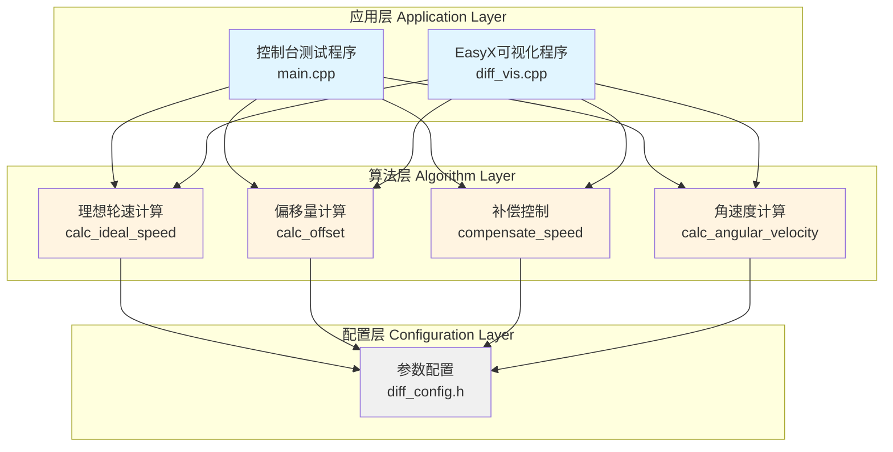
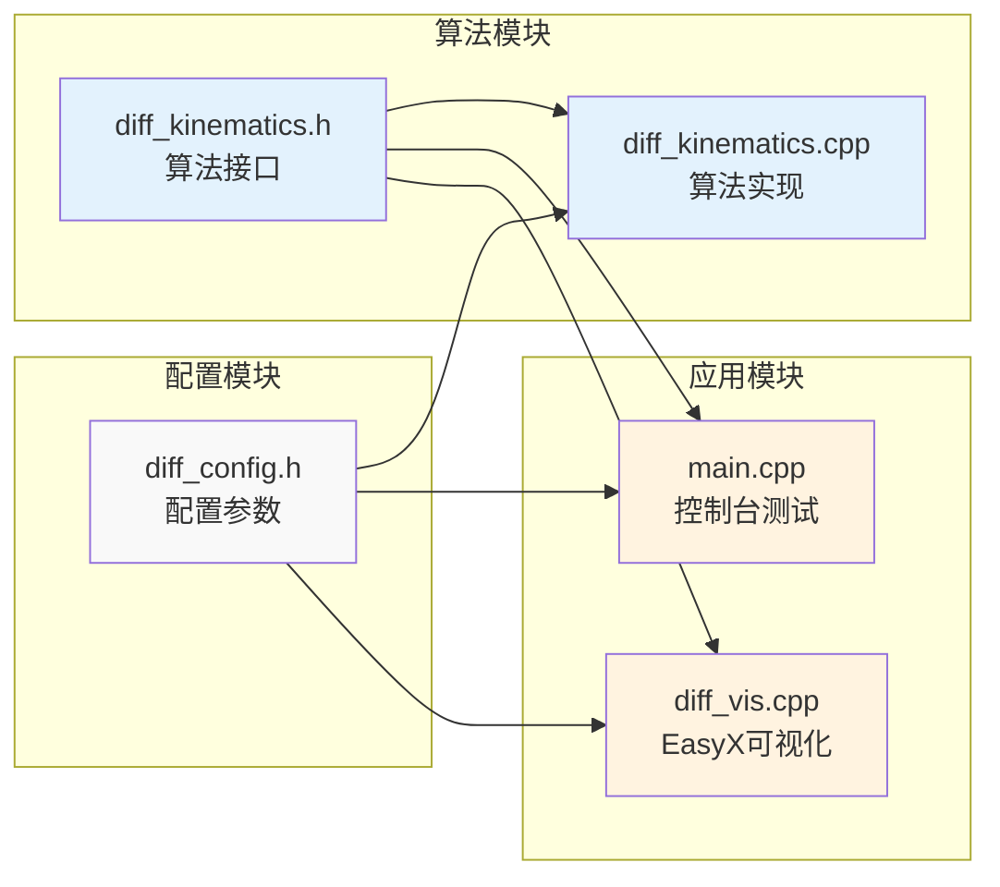
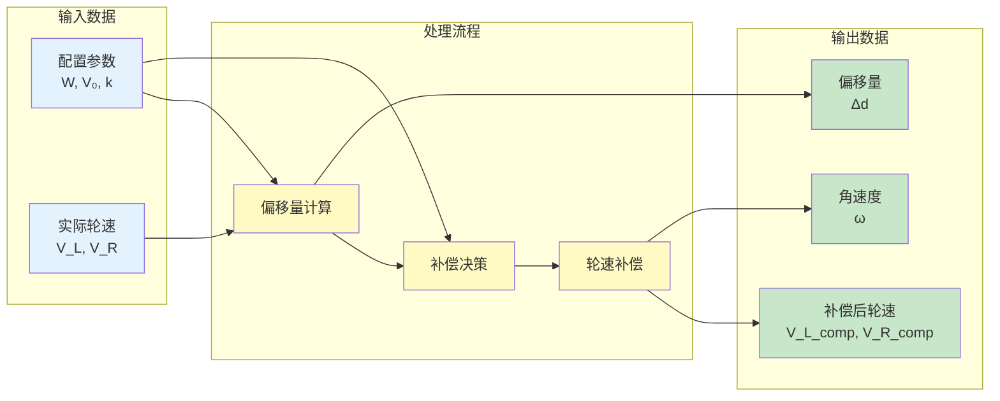

# 双轮差速移动机器人原地旋转控制系统架构设计

**课题名称： 双轮差速移动机器人原地旋转中心调节算法设计
**文档版本： v1.0
**编写日期： 2025年12月

---

## 一、系统整体架构

### 1.1 系统分层架构图



### 1.2 系统架构说明

**三层架构设计：**

1. 应用层（Application Layer）**
   - 控制台测试程序**：用于算法功能验证和数值测试
   - 可视化程序**：用于动态演示和结果可视化

2. 算法层（Algorithm Layer）**
   - 理想轮速计算**：根据理想运动学模型计算标准轮速
   - 偏移量计算**：实时检测旋转中心偏移
   - 补偿控制**：动态调整轮速消除偏移
   - 角速度计算**：计算机器人旋转角速度

3. 配置层（Configuration Layer）**
   - 参数配置文件**：定义机器人物理参数、控制参数、验证标准

**设计优势：**
-  模块化**：各层职责清晰，便于维护和扩展
-  可复用**：算法层与应用层解耦，可用于不同应用场景
-  可配置**：所有参数集中管理，修改方便

---

## 二、核心模块设计

### 2.1 模块关系图



### 2.2 模块详细说明

#### 模块1：配置模块（diff_config.h）

**功能： 定义所有系统参数和常量

**主要内容：**
```cpp
// 机器人物理参数
#define WHEEL_BASE_W       30.0f   // 轮距（cm）
#define ROBOT_LENGTH_L     40.0f   // 车身长度（cm）
#define ROBOT_WIDTH_B      30.0f   // 车身宽度（cm）

// 控制参数
#define BASE_SPEED_V0      5.0f    // 基准转速（cm/s）
#define COMPENSATION_COEFF_K 0.5f  // 补偿系数

// 验证标准
#define OFFSET_THRESHOLD   0.1f    // 偏移阈值（cm）
#define MAX_OFFSET_ALLOWED 1.5f    // 最大允许偏移（cm）
```

**设计特点：**
- 使用宏定义，便于编译期优化
- 参数集中管理，避免魔法数字
- 注释清晰，便于理解和修改

---

#### 模块2：算法模块（diff_kinematics.cpp/h）

**功能： 实现核心运动学算法

**对外接口（diff_kinematics.h）：**
```cpp
// 计算理想轮速
void calc_ideal_speed(float* V_L, float* V_R);

// 计算偏移量
float calc_offset(float V_L, float V_R);

// 计算补偿后的轮速
void compensate_speed(float delta_d, float* V_L, float* V_R);

// 计算角速度
float calc_angular_velocity(float V_L, float V_R);
```

**算法实现（diff_kinematics.cpp）：**
- 所有函数实现严格遵循公式推导
- 包含边界条件检查和错误处理
- 详细注释说明算法原理

---

#### 模块3：控制台测试模块（main.cpp）

**功能： 验证算法正确性

**测试内容：**
1. 理想轮速计算测试
2. 偏移量计算测试（5组测试用例）
3. 补偿算法测试（5组测试用例）
4. 闭环控制仿真测试（3组测试用例）

**输出格式：**
```
========================================
测试2：偏移量计算验证
========================================
用例1: V_L=-6.0, V_R=+4.0
  计算得 Δd = +3.000 cm
  [验证] 偏右3cm?  通过
```

---

#### 模块4：可视化模块（diff_vis.cpp）

**功能： 动态演示和结果可视化

**界面布局（暗黑主题，左右对调）：**
```
+---------------------------+---------------------------+
|        数据曲线区          |       机器人动画区         |
|  (500px, 左侧)            |  (700px, 右侧)            |
|                           |                           |
|   [轮速-时间曲线]          |     [机器人旋转动画]       |
|   - V_L (荧光绿线)        |     - 几何中心（亮红点）   |
|   - V_R (亮蓝线)          |     - 实际中心（天蓝点）   |
|   [偏移量-时间曲线]        |     - 车身旋转            |
|   - Δd (粉红线)          |                           |
+---------------------------+---------------------------+
|              控制区 & 信息显示区                       |
|  [空格:启动/暂停] [R:重置] [N:下一个] [P:上一个]      |
+-------------------------------------------------------+
```

**技术实现：**
- 使用EasyX图形库绘制
- 实时更新数据曲线
- 交互式控制（暂停、重置、切换用例）

---

## 三、算法流程设计

### 3.1 主控制流程图

```mermaid
flowchart TD
    START([开始]) --> INIT[初始化参数<br/>读取配置]
    INIT --> INPUT[获取实际轮速<br/>V_L_actual, V_R_actual]
    INPUT --> CALC_OFFSET[计算偏移量<br/>Δd = calc_offset]
    CALC_OFFSET --> CHECK{|Δd| > 阈值?}

    CHECK -->|是| COMPENSATE[计算补偿轮速<br/>compensate_speed]
    CHECK -->|否| IDEAL[使用理想轮速<br/>calc_ideal_speed]

    COMPENSATE --> OUTPUT[输出轮速到电机]
    IDEAL --> OUTPUT

    OUTPUT --> UPDATE[更新机器人状态]
    UPDATE --> VISUALIZE[可视化显示]
    VISUALIZE --> END_CHECK{是否结束?}

    END_CHECK -->|否| INPUT
    END_CHECK -->|是| END([结束])

    style START fill:#c8e6c9
    style END fill:#ffcdd2
    style CHECK fill:#fff9c4
    style COMPENSATE fill:#ffe0b2
    style IDEAL fill:#e1f5fe
```

### 3.2 补偿算法详细流程

```mermaid
flowchart TD
    START([输入: Δd]) --> CHECK1{|Δd| < 阈值?}

    CHECK1 -->|是| NO_COMP[不需要补偿<br/>V_L = -V₀<br/>V_R = +V₀]
    CHECK1 -->|否| CALC_DV[计算补偿速度<br/>ΔV = k × Δd]

    CALC_DV --> APPLY[应用补偿<br/>V_L = -V₀ + ΔV<br/>V_R = +V₀ - ΔV]

    APPLY --> VERIFY[验证旋转中心<br/>r_L = W×|V_L|/|V_L+V_R|<br/>Δd_new = r_L - W/2]

    NO_COMP --> OUTPUT([输出: V_L, V_R])
    VERIFY --> OUTPUT

    style START fill:#e8f5e9
    style OUTPUT fill:#fff3e0
    style CHECK1 fill:#fff9c4
    style CALC_DV fill:#ffe0b2
```

---

## 四、数据流向设计

### 4.1 数据流向图



### 4.2 数据结构说明

| 数据类型 | 变量名 | 数据类型 | 单位 | 说明 |
|---------|--------|---------|------|------|
| 输入 | V_L_actual | float | cm/s | 左轮实际速度 |
| 输入 | V_R_actual | float | cm/s | 右轮实际速度 |
| 中间 | delta_d | float | cm | 旋转中心偏移量 |
| 中间 | delta_V | float | cm/s | 补偿速度 |
| 输出 | V_L_compensated | float | cm/s | 补偿后左轮速度 |
| 输出 | V_R_compensated | float | cm/s | 补偿后右轮速度 |
| 输出 | omega | float | rad/s | 角速度 |

---

## 五、关键技术点

### 5.1 运动学建模

**理论基础： 差速驱动运动学

**核心公式：**
```
理想轮速：V_L = -V_R
角速度：  ω = 2V₀ / W
偏移计算：Δd = (W/2) × (|V_L| - |V_R|) / (|V_L| + |V_R|)
```

### 5.2 比例控制（P控制）

**控制策略： 补偿速度与偏移量成正比

**控制公式：**
```
ΔV = k × Δd
V_L_compensated = -V₀ + ΔV
V_R_compensated = +V₀ - ΔV
```

**参数整定：**
- k值范围：[0.3, 0.8] cm/(s·cm)
- 推荐值：k = 0.5 cm/(s·cm)
- 原则：快速收敛 + 稳定性

### 5.3 闭环控制

**反馈机制：**
```
实时轮速 → 偏移检测 → 补偿计算 → 轮速调整 → 实时轮速
```

**稳定性保证：**
- 偏移阈值：0.1 cm（避免频繁调整）
- 最大偏移：1.5 cm（5%轮距）
- 收敛时间：≤ 3 秒

---

## 六、性能指标

### 6.1 功能指标

| 指标类型 | 指标要求 | 验证方法 |
|---------|---------|---------|
| 偏移量精度 | \|Δd\| ≤ 1.5 cm | 控制台测试 + 可视化验证 |
| 收敛时间 | t ≤ 3 秒 | 闭环仿真测试 |
| 速度精度 | \|V_L + V_R\| ≤ 0.5 cm/s | 数值计算验证 |

### 6.2 代码质量指标

| 指标类型 | 指标要求 |
|---------|---------|
| 代码行数 | 核心算法 < 200 行 |
| 注释率 | ≥ 30% |
| 函数复杂度 | 单函数 < 50 行 |
| 模块化程度 | 高内聚、低耦合 |

---

## 七、扩展性设计

### 7.1 可扩展方向

1. 控制算法升级**
   - 从P控制升级到PI控制（消除稳态误差）
   - 从PI控制升级到PID控制（提高了响应速度）

2. 运动模式扩展**
   - 直线运动控制
   - 圆弧轨迹跟踪
   - 任意曲线路径规划

3. 硬件平台移植**
   - 树莓派 + Python实现
   - Arduino + C实现
   - ROS集成

### 7.2 预留接口

```cpp
// 预留传感器接口
void update_sensor_data(float* encoder_L, float* encoder_R);

// 预留电机控制接口
void send_to_motor(float V_L, float V_R);

// 预留日志接口
void log_data(float timestamp, float Δd, float V_L, float V_R);
```

---

## 八、总结

### 8.1 架构特点

-  清晰的分层设计**：应用层、算法层、配置层职责明确
-  模块化实现**：各模块独立开发、测试、维护
-  良好的可扩展性**：预留接口，便于功能扩展
-  完善的测试验证**：控制台测试 + 可视化验证

### 8.2 技术亮点

1. 运动学建模精确**：完整的数学推导和公式验证
2. 控制算法简洁**：P控制实现简单、效果良好
3. 代码质量高**：规范的命名、详细的注释
4. 可视化效果好**：直观展示算法效果

---

**文档编写： 郭雨诺
**审核状态： 已完成
**最后更新： 2025年12月
